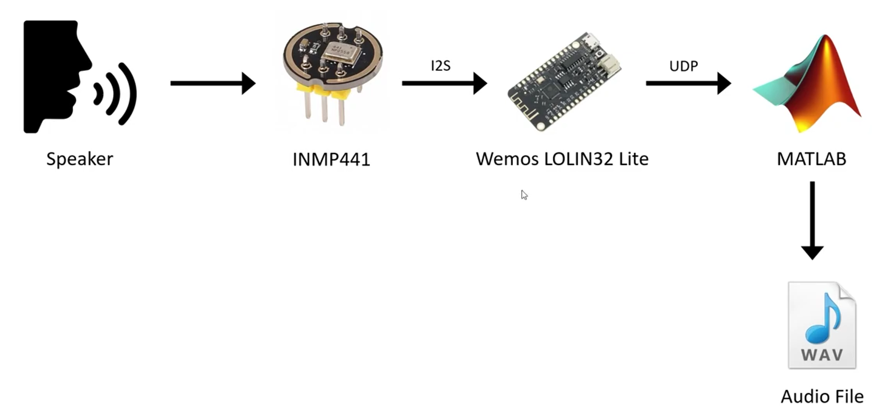
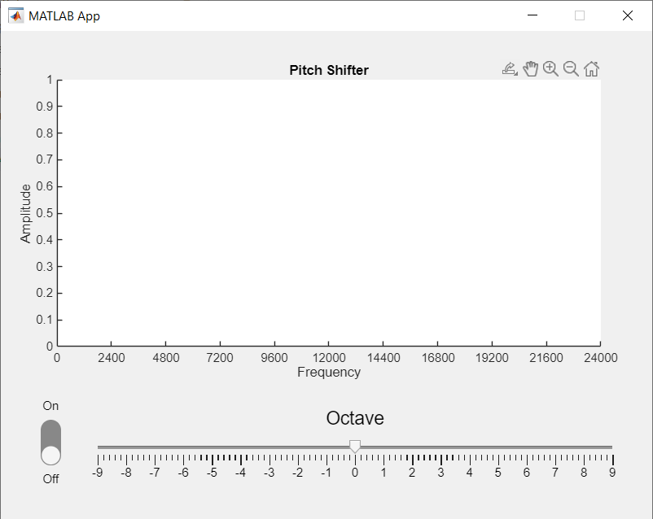

# Real-time Pitch Changer with Arduino and MATLAB

## What is this
This is a signal processing mini-project which transmit real time audio data from arduino via UDP broadcasting and MATLAB will receive audio data and then process it internally.

## Overview of Block Diagram

## MATLAB GUI Demo
